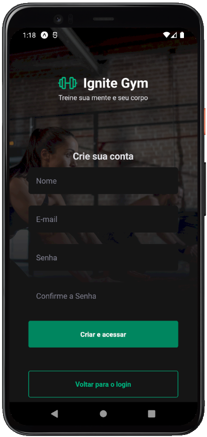
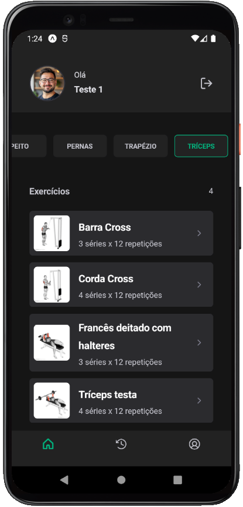
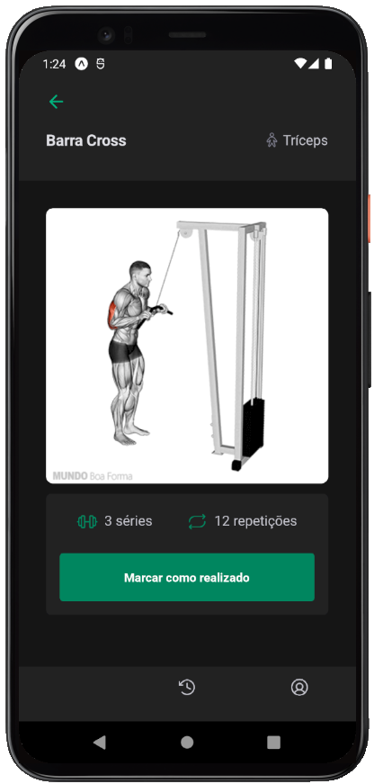
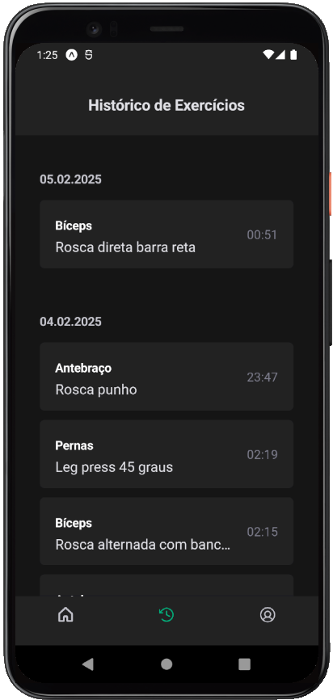
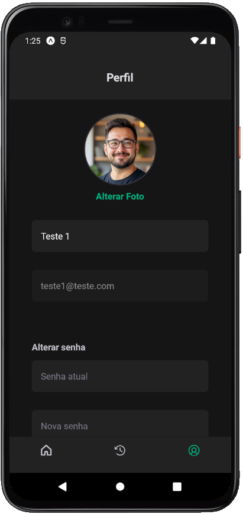

# Ignite Gym

<p align="center">
  
  
  
</p>
<p align="center">
  
  
  
</p>

<br>

## 💻 Projeto

**[Ignite Gym](https://github.com/AdrianoTobias/ignitegym)**, é uma aplicação mobile com o framework Expo, voltada a frequentadores de academia, a qual engloba funcionalidades como listagem de exercícios (filtrados por parte do corpo), detalhes do exercício em si, possibilidade de marcar o exercício como realizado e o histórico de exercícios realizados. Tudo para impulsionar cada série do treino. Além disso, permite a edição de perfil.

O projeto possui, ainda, autenticação e controle de acesso a rotas, bem como a implementação de refresh token.

É uma aplicação desenvolvida durante o **[MBA Fullstack](https://www.rocketseat.com.br/mba)**, provido pela **[Rocketseat](https://rocketseat.com.br/)**, em parceria com a **[Sirius Education](https://landing.sirius.education/home/)**.


## 🧪 Tecnologias

Esse projeto foi desenvolvido com as seguintes tecnologias:

- [React Native](https://reactnative.dev/)
- [Expo](https://expo.dev/)
- [TypeScript](https://www.typescriptlang.org/)
- [Gluestack](https://gluestack.io/)


## 🚀 Como executar

Clonar o projeto e acessar a pasta do mesmo:

```bash
$ git clone https://github.com/AdrianoTobias/ignitegym.git
$ cd ignitegym
```

Para iniciá-lo:
```bash
# Instalar as dependências
$ npm install
```

```bash
# Iniciar a aplicação
$ npx expo start
```
A aplicação poderá ser acessada via dispositivo (físico ou emulador), através do [Expo Go](https://docs.expo.dev/get-started/set-up-your-environment/).


As API's consumidas por esse projeto são providas por um servidor externo, o qual precisa ser baixado e executado, conforme sua respectiva [documentação](https://github.com/orodrigogo/ignitegym-api).


[Adriano Tobias](https://github.com/AdrianoTobias)